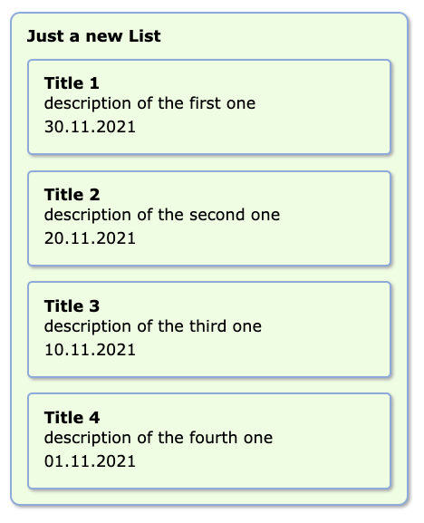

# XSLT transformer


Simply running:  
``` javascript
var target = document.getElementById('root'),
    source = {
        xsl: 'xsl/list.xsl',
        xml: 'xml/list.xml'
    };

function cback() {
    console.log('done: ', arguments)
}

// use xstl transformer
Processor
    .initProcessor(source.xsl)
    .render(source.xml, target, cback);

```

get the following:  
<sub>(ok, ... some stylesheets are needed but)</sub>  


Given `list.xml` as
``` xml
<?xml version="1.0"?>
<response>
    <status>
        <code>0</code>
    </status>
    <newsList>
        <news>
            <id>1</id>
            <title>Title 1</title>
            <date>30.11.2021T00:00.00</date>
            <shortText>description of the first one</shortText>
            <important>LOW</important>
        </news>
        <news>
            <id>2</id>
            <title>Title 2</title>
            <date>20.11.2021T00:00.00</date>
            <shortText>description of the second one</shortText>
            <important>LOW</important>
        </news>
        <news>
            <id>3</id>
            <title>Title 3</title>
            <date>10.11.2021T00:00.00</date>
            <shortText>description of the third one</shortText>
            <important>LOW</important>
        </news>
        <news>
            <id>4</id>
            <title>Title 4</title>
            <date>01.11.2021T00:00.00</date>
            <shortText>description of the fourth one</shortText>
            <important>LOW</important>
        </news>
    </newsList>
</response>    
```

and `list.xsl` as

``` xml
<?xml version="1.0" encoding="ISO-8859-1"?>
<xsl:stylesheet version="1.0" xmlns:xsl="http://www.w3.org/1999/XSL/Transform">
  <xsl:template name="FormatDate">
    <xsl:param name="DateTime" />
      <xsl:value-of select="substring($DateTime,0,11)" />
  </xsl:template>
  <xsl:template match="/">
    <div class="round10">
      <strong>Just a new List</strong>
      <ul>
        <xsl:for-each select="response/newsList/news">
          <li class="item round5">
            <xsl:attribute name="id">
              <xsl:value-of select="concat('item-', id)"/>
            </xsl:attribute>
            <strong><xsl:value-of select="title" /></strong>
            <p class="short-desc"><xsl:value-of select="shortText" /></p>
            <p class="date"><xsl:call-template name="FormatDate">
              <xsl:with-param name="DateTime" select="date" />
            </xsl:call-template></p>
          </li>
        </xsl:for-each>
      </ul>
    </div>
  </xsl:template>
</xsl:stylesheet> 
```


